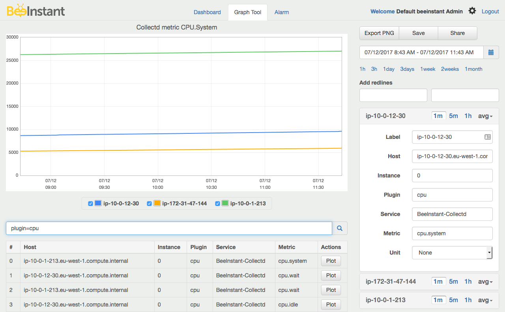

# Collectd Integration
This is a Java Plugin for CollectD. It publishes CollectD metrics to BeeInstant by using [BeeInstant Java SDK](https://github.com/beeinstant-dev/beeinstant-java-sdk).



## Setup
* Clone this repo `git@github.com:beeinstant-dev/collectd-integration.git`.
* Build `mvn package`
* Copy the built jar to Collectd java plugin folder. Example for Ubuntu `sudo cp target/collectd-integration.jar /usr/share/collectd/java/`.
* Configure the plugin in `/etc/collectd/collectd.conf`.
    ```
    LoadPlugin java
    <Plugin java>
        JVMArg "-verbose:jni"
        JVMArg "-Djava.class.path=/usr/share/collectd/java/collectd-api.jar:/usr/share/collectd/java/collectd-integration.jar"

        LoadPlugin "com.beeinstant.CollectdIntegration"
        <Plugin "CollectdIntegration">
            <BeeInstant>
                Host "<beeinstant-endpoint>"
                PublicKey "<beeinstant-public-key>"
                SecretKey "<beeinstant-secret-key>"
            </BeeInstant>
        </Plugin>
    </Plugin>
    ```
* Restart collectd `sudo service collectd restart`.